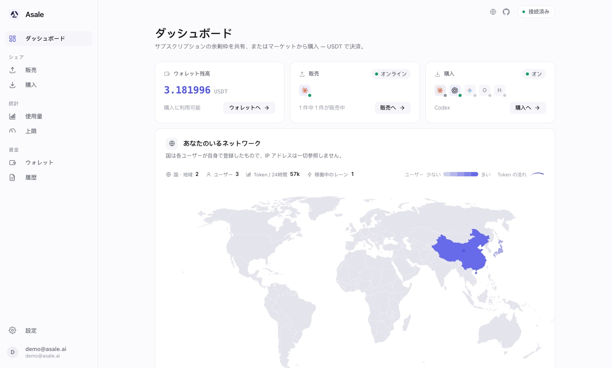
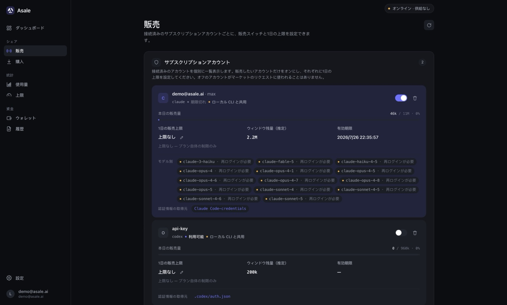
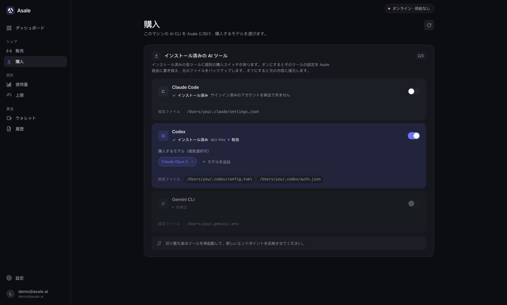
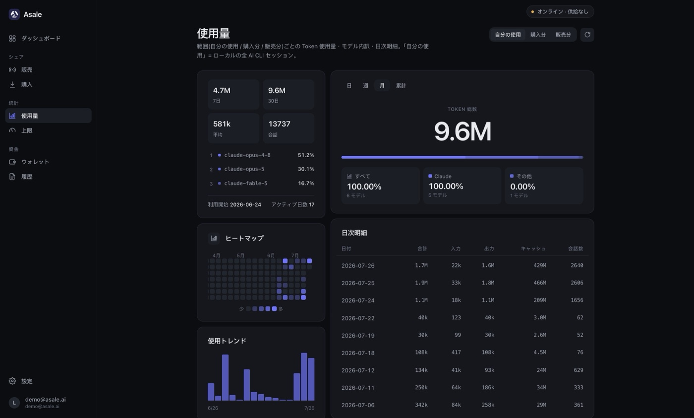

# Asale クライアント

### 使い切れなかったトークンを、必要な人へ

余った枠は収益に。上限に当たったときは誰かが引き継ぐ。

[English](README.md) · [简体中文](README.zh-CN.md) · [繁體中文](README.zh-TW.md) · **日本語**

[公式サイト](https://asale.ai) · [マーケット](https://asale.ai/ja/market) ·
[世界分布](https://asale.ai/ja/distribution) · [ウォレット](https://asale.ai/ja/wallet) ·
[**⬇ クライアントをダウンロード**](#ダウンロードとインストール)

---

## これは何か

あなたは Claude Pro / Max、ChatGPT Plus / Codex のような**サブスクリプション課金**の
プランを契約しています。枠はウィンドウごとに更新され、使い切らなければ消えてしまう。
その一方で、地球の反対側では誰かが上限に当たり、ウィンドウのリセットを待っています。

**Asale はトークン共有ネットワーク**で、この 2 つを結びつけます。

- **販売** —— 余ったサブスクリプション枠がマーケットに出て、上限に当たった人が引き継ぎ、
  あなたは USDT を受け取ります。
- **購入** —— 手元の AI CLI を Asale に向けるだけで、公式 API より安い価格で他の人の
  余剰枠を使えます。

プラットフォームが行うのは**マッチング・転送・課金**だけ。決済は 1 分ごと、通貨は
USDT（TRC20）です。

このリポジトリはその**デスクトップクライアント**です。販売側と購入側の両方が
1 つのアプリに入っています。

### トークンの提供元プラットフォーム

Claude Pro / Max · ChatGPT / Codex · Google Gemini · Kimi · xAI Grok

このうちクライアントでログインと設定切り替えを実装済みなのは **Claude Code**、
**Codex**、**Gemini CLI** です。他はプロトコル上の位置は確保済みで、アダプタの実装
に合わせて追加されます。

---

## 機能

### 販売 · 余ったサブスクリプションを共有する

接続済みのサブスクリプションアカウントごとに**個別のスイッチ**があり、オンにした
アカウントだけがマーケットのリクエストを受けます。1 日の販売上限もアカウント単位で
設定でき、到達すると自動停止。ウィンドウ残量・有効期限・当日の販売量が一目で分かります。

認証情報はこのマシンでログイン済みの CLI（`Claude Code credentials`、`.codex/auth.json`
など）から取得するほか、クライアント内で OAuth ログインし直すこともできます。
**認証情報はマシンの外に出ません** —— OS キーチェーンに保存され、データベースには
参照のみが入ります。

### 購入 · ローカルの AI CLI を Asale 経由にする

インストール済みのツール（Claude Code / Codex / Gemini CLI）を自動検出し、ツールごとに
スイッチを用意します。オンにするとそのツールの設定を Asale 向けに書き換え、
**元のファイルをバックアップ**。オフにすればそのまま復元されるので、いつでも公式に
戻せます。購入するモデルはツールごとに複数選択できます。

### 使用量と上限 · 自分の日常利用分まで売らないために

「自分が使った / 買った / 売った」の 3 つの軸でトークン使用量・モデル分布・日次内訳を
集計し、ヒートマップとトレンドグラフで表示します。上限ページでは販売上限を
**サブスクリプション枠に対する割合**で指定できるので、自分用の余裕を必ず残せます。

### ウォレットと履歴

ウォレットページでは USDT の入出金を照合します。利用可能残高、凍結（事前承認）分、
未決済の収益、入出金は TRON 経由。履歴ページには中継 1 件ずつが並び、
**販売側と購入側の記録を突き合わせられる**ため、プラットフォーム手数料率が正しく
効いているかを自分で確認できます。同じデータは
[Web コンソール](https://asale.ai/ja/records)でも見られます。

---

## ダウンロードとインストール

無料です。いちばん簡単なのは[**公式サイト**](https://asale.ai)を開くこと。OS を自動判別して
対応するインストーラを渡します。直接リンクからでも構いません:

| プラットフォーム | 直接リンク |
|---|---|
| macOS（Apple シリコン / Intel ユニバーサル） | [asale.ai/dl/mac](https://asale.ai/dl/mac) |
| Windows | [asale.ai/dl/windows](https://asale.ai/dl/windows) |
| Linux AppImage | [asale.ai/dl/linux-appimage](https://asale.ai/dl/linux-appimage) |
| Linux .deb | [asale.ai/dl/linux-deb](https://asale.ai/dl/linux-deb) |

上の表にバージョン番号がないのは意図的です。各リンクはクリックした時点で最新の
[GitHub リリース](https://github.com/asale-ai/asale/releases)を解決するため、ここが古くなることは
ありません。そのリリースにないプラットフォームはダウンロード欄に戻ります —— Windows / Linux 版は
対応する OS 上でビルドする必要があります（Tauri はクロスプラットフォームでのパッケージングに
対応していません）。[開発ドキュメント · パッケージング](docs/DEVELOPMENT.ja.md#パッケージング)を参照。

### macOS でのインストール

1. `.dmg` をダウンロードし、開いて **Asale** を「アプリケーション」にドラッグします。
2. 現行ビルドは **Apple の署名・公証を行っていない**ため、初回起動はブロックされます。
   **システム設定 → プライバシーとセキュリティ**で「このまま開く」をクリックするか、
   ターミナルで `xattr -dr com.apple.quarantine /Applications/Asale.app` を実行してください。

インストール後はバックグラウンドに常駐し（メニューバーアイコン）、ログイン時の自動起動と
自動アップデートに対応します。

### 初回セットアップ

1. クライアントを開き、Asale アカウントで**ログイン**します（未登録なら
   [asale.ai](https://asale.ai) で登録。OAuth 対応）。
2. **売りたい場合**：「販売」ページ →「サブスクリプションを接続」でプラットフォームを
   選び OAuth ログイン。マシン上の既存 CLI 認証情報も自動で認識されます。アカウントの
   スイッチをオンにし、1 日の上限を設定して、状態が「オンライン」になれば受注開始です。
3. **買いたい場合**：まず「ウォレット」で USDT をチャージし、「購入」ページで対象ツールの
   スイッチをオンにしてモデルを選び、**その CLI を再起動**して新しい接続先を反映させます。

> ⚠️ 実行中の Claude Code セッションの中から Claude Code の購入スイッチを切り替えないで
> ください —— 設定が書き換わり、そのセッションが切断されます。切り替えたらツールを
> 再起動してください。

---

## セキュリティとプライバシー

[公式サイトの「セキュリティとプライバシー」](https://asale.ai/ja)と同じ内容を、
コードに対応づけた版です。

- **会話の内容を保存もキャッシュもしません。** プラットフォームが行うのはマッチング・
  転送・課金だけ。データベースに本文カラムはなく、メモリ上でチャンクごとに転送し、
  Redis にも入れず、ログにも本文を出しません。
- **全経路で暗号化と署名。** すべてのホップが TLS 1.2/1.3 の中で行われ、デバイスは
  Ed25519 の識別子でハンドシェイクに署名し、配信のたびに検証されます。クライアントは
  **平文のリモートアドレスを一切拒否**します（loopback 以外は https/wss 必須）。
- **勝手に収集しません。** 送信する項目はランダム UUID のデバイス ID、バージョン、
  OS 名、ハートビートのみ。ハードウェアフィンガープリントも IP 位置測定も行わず、
  使用量の統計はマシンの外に出ません。
- **認証情報はマシンの外に出ません。** サブスクリプションの認証情報は OS キーチェーンと
  `~/.asale/auths` に保存され、サーバーは参照しか受け取りません。

> **正直に書いておきます：** リクエストは最終的に別のユーザーのクライアントが上流へ
> 送信するため、その瞬間の本文はそのクライアントから見えます。エンドツーエンド暗号化は
> 行っておらず、また行うこともできません。**機密情報は送信しないでください。**

クライアントのソースコードはこのリポジトリにあり、上記のすべてを自分で確認できます。

---

## 開発者向け

アーキテクチャ、ローカル開発、パッケージングとリリース手順は
**[docs/DEVELOPMENT.ja.md](docs/DEVELOPMENT.ja.md)** を参照してください。

---

## ライセンスとリスク

[Apache License 2.0](LICENSE)

Asale は技術的な中継のみを提供します。**サブスクリプションの計算資源を共有することは
上流サービスの利用規約に違反する可能性があり、リスクは利用者が負います。**
