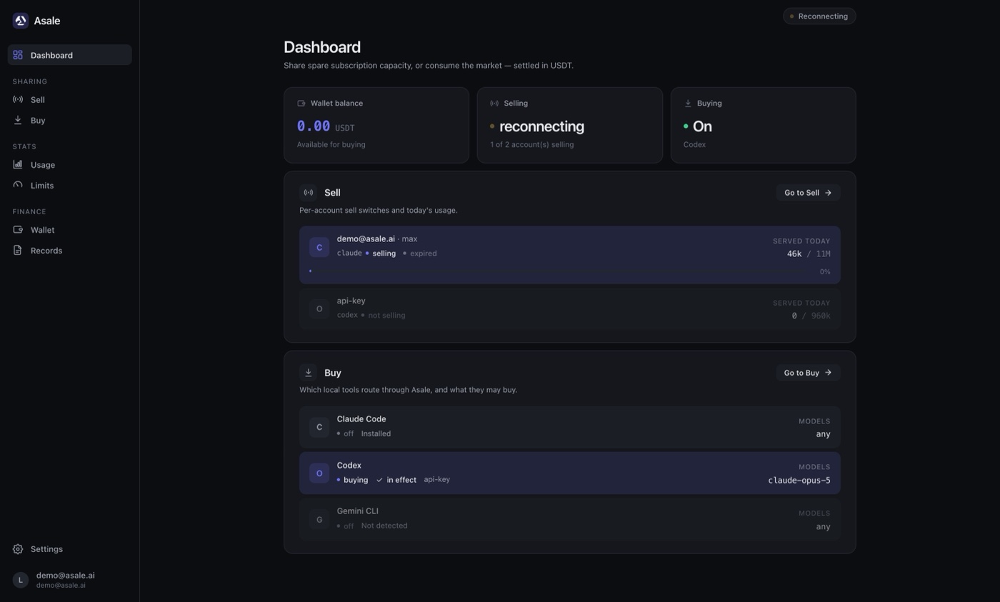
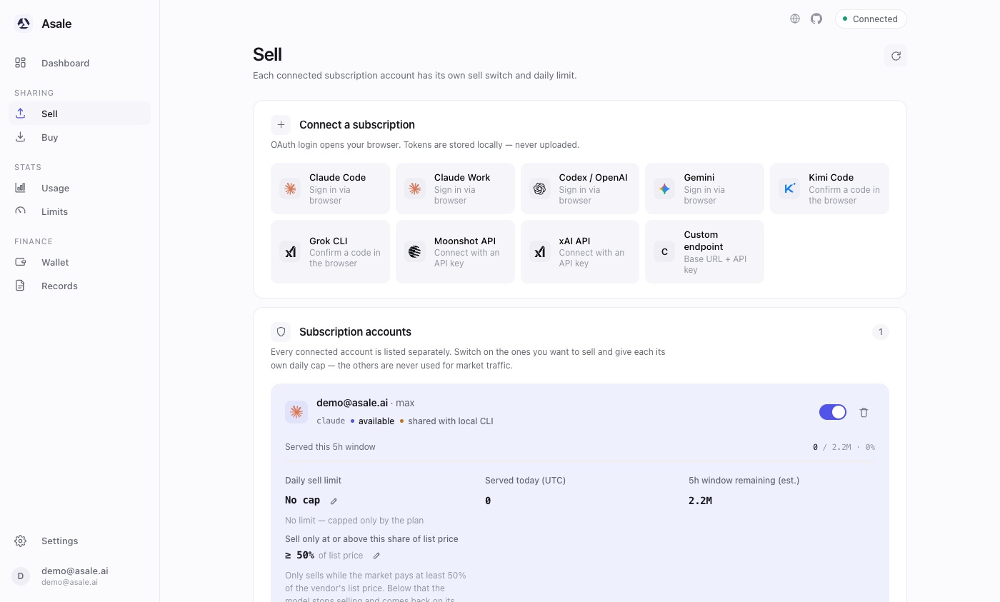
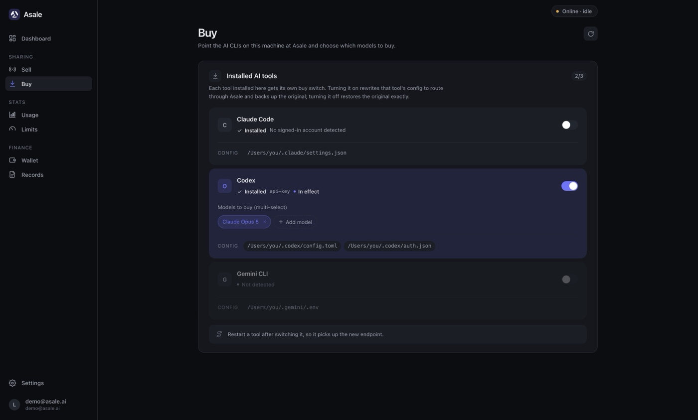
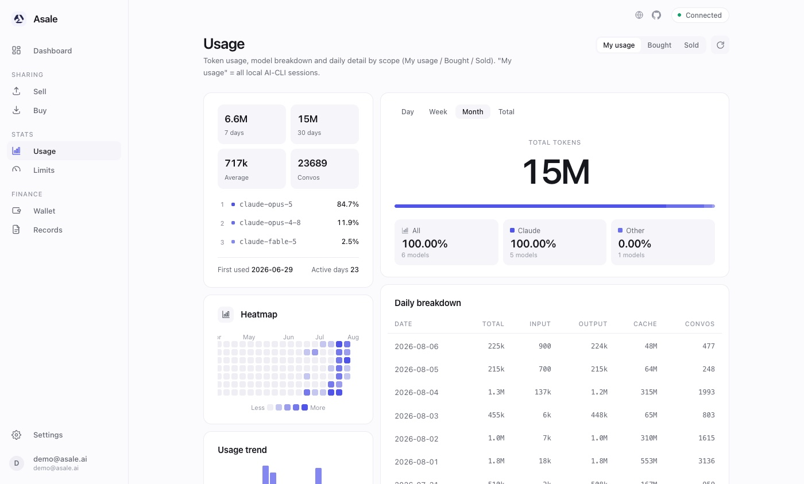

# Asale Client

### Share the tokens you don't use

Turn idle quota into income; when you hit a limit, someone else takes over.

**English** · [简体中文](README.zh-CN.md) · [繁體中文](README.zh-TW.md) · [日本語](README.ja.md)

[Website](https://asale.ai) · [Market](https://asale.ai/en/market) ·
[Global map](https://asale.ai/en/distribution) · [Wallet](https://asale.ai/en/wallet) ·
[**⬇ Download the client**](#download--install)

---

## What is this

You pay for Claude Pro / Max, ChatGPT Plus / Codex — plans billed **by subscription**.
Quota refreshes per window and whatever you don't use is gone; meanwhile, on the other
side of the planet, someone is stuck at a limit waiting for their window to reset.

**Asale is a token sharing network** that connects those two facts:

- **Sell** — your idle subscription quota goes on the market, someone who hits a limit
  picks it up, and you get paid in USDT.
- **Buy** — point your AI CLI at Asale and run on someone else's idle quota, below the
  price of the official API.

The platform only does **matching, forwarding and billing**. Settlement runs once a
minute, in USDT (TRC20).

This repository is the **desktop client** — selling and buying both live in this one app.

### Supported token sources

Claude Pro / Max · ChatGPT / Codex · Google Gemini · Kimi · xAI Grok

Of these, the client currently implements login and config switching for **Claude Code**,
**Codex** and **Gemini CLI**; the rest already have a slot in the protocol and land as
adapters are filled in.

---

## Features

### Sell · put idle subscriptions on the market

Every connected subscription account gets **its own switch** — only the accounts you turn
on take market requests. The daily sell limit is set per account and stops automatically
when reached; remaining window quota, expiry and today's sales are all on screen.

Credentials come from the CLIs already logged in on this machine (`Claude Code
credentials`, `.codex/auth.json`, …), or you can re-run OAuth inside the client.
**Credentials never leave your machine** — they go into the OS keychain, and the database
only stores a reference.

### Buy · route your local AI CLIs through Asale

The client detects which tools are installed (Claude Code / Codex / Gemini CLI) and gives
each one a switch. Turning it on rewrites that tool's config to point at Asale and
**backs up the original file**; turning it off restores it exactly — you can go back to
official at any time. Models to buy are picked per tool, multi-select.

### Usage & limits · don't sell away your own daily quota

Token usage, model distribution and daily breakdowns are tracked along three axes — *used
by me* / *bought* / *sold* — with a heatmap and trend charts. The limits page expresses
the sell cap as a **percentage of your subscription quota**, so you always keep headroom
for your own work.

### Wallet & records

The wallet page reconciles USDT in and out: available balance, held (pre-authorized) funds
and pending earnings, with deposits and withdrawals over TRON. The records page lists every
relayed request — **seller-side and buyer-side records can be cross-checked against each
other**, so the platform's fee ratio is verifiable. The same data is available in the
[web console](https://asale.ai/en/records).

---

## Download & install

Free. The quickest route is [**asale.ai**](https://asale.ai) — it detects your OS and hands
you the right installer. Or go straight at one:

| Platform | Direct link |
|---|---|
| macOS (universal, Apple silicon / Intel) | [asale.ai/dl/mac](https://asale.ai/dl/mac) |
| Windows | [asale.ai/dl/windows](https://asale.ai/dl/windows) |
| Linux AppImage | [asale.ai/dl/linux-appimage](https://asale.ai/dl/linux-appimage) |
| Linux .deb | [asale.ai/dl/linux-deb](https://asale.ai/dl/linux-deb) |

No version numbers above on purpose: each link is resolved against the newest
[GitHub release](https://github.com/asale-ai/asale/releases) at the moment you click it, so
nothing here can go stale. A platform that release did not build lands you back on the
download section — Windows and Linux bundles have to be produced on the matching OS
(Tauri cannot cross-compile), see [Development · Packaging](docs/DEVELOPMENT.md#packaging).

### Installing on macOS

1. Download the `.dmg`, open it and drag **Asale** into Applications.
2. This build is **not Apple-signed or notarized yet**, so the first launch is blocked.
   Go to **System Settings → Privacy & Security** and click "Open Anyway", or run
   `xattr -dr com.apple.quarantine /Applications/Asale.app` in a terminal.

Once installed the app stays resident in the background (menu bar icon), supports launch
at login, and updates itself.

### First run

1. Open the client and **sign in** with your Asale account (register at
   [asale.ai](https://asale.ai) if you don't have one — OAuth supported).
2. **To sell**: go to *Sell* → *Connect subscription*, pick a platform and complete OAuth;
   the client also picks up CLI credentials already present on this machine. Turn the
   account switch on, set a daily limit, and once the status reads "online" you start
   receiving jobs.
3. **To buy**: top up USDT in *Wallet*, then in *Buy* turn on the switch for a tool, pick
   the models, and **restart that CLI** so the new endpoint takes effect.

> ⚠️ Don't flip the Claude Code buy switch from inside a running Claude Code session —
> rewriting the config disconnects the session you're in. Flip it, then restart the tool.

---

## Security & privacy

Same claims as the [website's security page](https://asale.ai/en), mapped to the code:

- **No conversation content is stored or cached.** The platform only matches, forwards and
  bills: there is no body column in the database, chunks are forwarded in memory, nothing
  goes into Redis, and logs never print bodies.
- **Encrypted and signed end to end of every hop.** Every hop runs inside TLS 1.2/1.3;
  devices sign the handshake with an Ed25519 identity and every dispatch is verified. The
  client **refuses any plaintext remote address** (non-loopback must be https/wss).
- **No silent collection.** The only reported fields are a random UUID device ID, version,
  OS name and a heartbeat — no hardware fingerprinting, no IP geolocation, and usage
  statistics never leave your machine.
- **Credentials stay local.** Subscription credentials live in the OS keychain and
  `~/.asale/auths`; the server only ever receives a reference.

> **Stated plainly:** a request is ultimately relayed to the upstream provider by another
> user's client, and at that moment the body is visible to that client. We do not — and
> cannot — offer end-to-end encryption. **Do not send confidential material.**

The client source is in this repository; every claim above can be checked against it.

---

## Developers

Architecture, local development, packaging and the release process are in
**[docs/DEVELOPMENT.md](docs/DEVELOPMENT.md)**.

---

## License & risk

[Apache License 2.0](LICENSE)

Asale is a technical relay only. **Sharing subscription capacity may violate upstream
terms of service — you assume that risk.**
