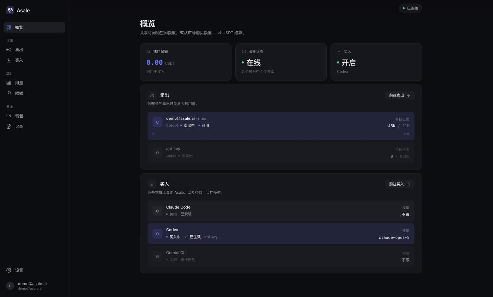
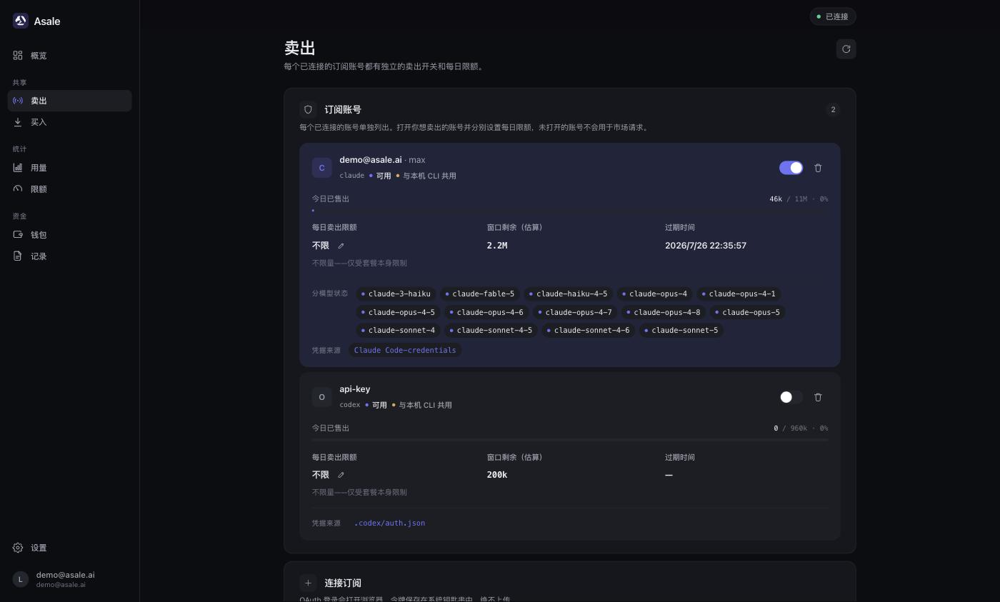
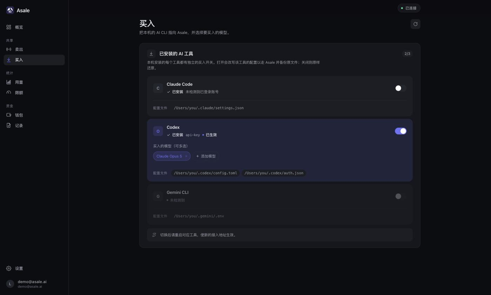
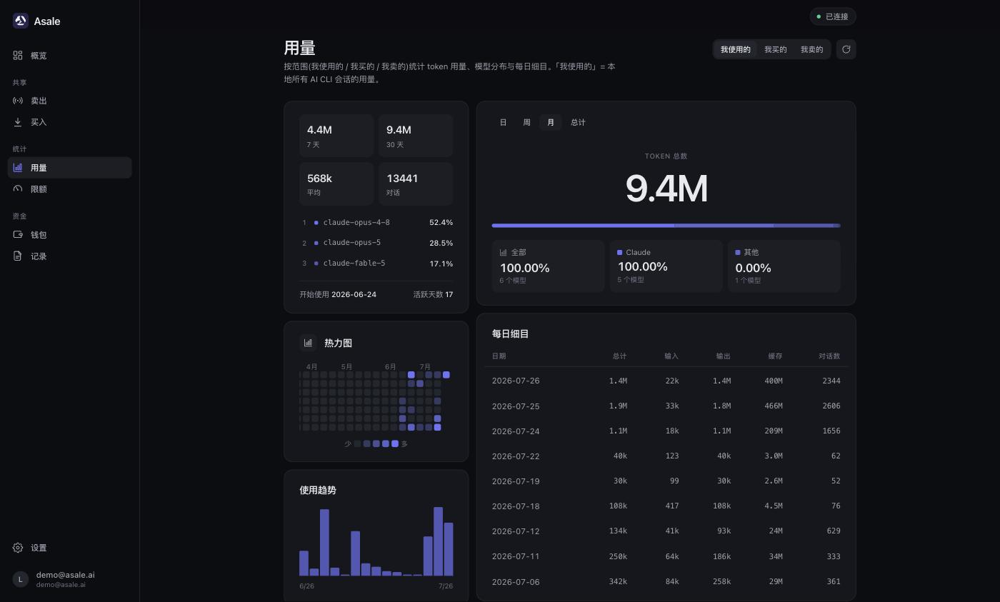

# Asale 客户端

**把没用完的 Token，分享给需要的人。** 闲置额度换成收益，撞上限额时有人接力。

Asale 是一个 **Token 分享平台**：你把 Claude Pro / Max、ChatGPT / Codex 这类订阅里
用不完的额度共享出去，别人撞到限额时接过去用，结算走 USDT。这里是它的
**桌面客户端** —— 分享方和使用方都在这里，一个应用两件事。

官网 <https://asale.ai> · [模型市场](https://asale.ai/zh/market) ·
[全球分布](https://asale.ai/zh/distribution) · [钱包](https://asale.ai/zh/wallet)



---

## 下载

最新版 **v0.1.0**，免费。

| 平台 | 安装包 | 状态 |
|---|---|---|
| macOS（Apple 芯片 / Intel 通用） | [Asale_0.1.0_universal.dmg](https://asale.ai/download/Asale_0.1.0_universal.dmg) | ✅ 可下载 |
| Windows | `Asale_0.1.0_x64-setup.exe` | 即将推出 |
| Linux AppImage | `Asale_0.1.0_amd64.AppImage` | 即将推出 |
| Linux .deb | `Asale_0.1.0_amd64.deb` | 即将推出 |

也可以直接从官网首页下载（会自动识别你的系统）：<https://asale.ai>

安装包随站点一起发布（站点仓库的 `public/download/` 下各存一份）。
Tauri 不能跨系统打包 —— `.dmg` 只能在 macOS 出，`.exe` 只能在 Windows 出，
`.deb`/`.AppImage` 只能在 Linux 出，所以 Windows / Linux 版要在对应系统上跑一次
[打包脚本](#打包)。macOS 包目前未做 Apple 签名与公证，首次打开需要在
「系统设置 → 隐私与安全性」里放行。

---

## 它能做什么

### 卖出：把闲置订阅共享出去



- 每个已连接的订阅账号**单独一个开关**，只有你打开的账号才会接市场请求。
- 每日卖出限额按账号设置，到额自动停；窗口剩余、过期时间、当日已售一目了然。
- 凭证来自本机已登录的 CLI（`Claude Code credentials`、`.codex/auth.json` …），
  也可以在客户端里走 OAuth 重新登录。**凭证只留在本机**，进 OS keychain，
  数据库里只存引用。

### 买入：让本机的 AI CLI 走 Asale



- 自动检测本机装了哪些工具（Claude Code / Codex / Gemini CLI），每个工具一个开关。
- 打开时改写该工具的配置指向 Asale，并**备份原文件**；关闭时原样还原。
- 按工具选要买入的模型，可多选。

### 用量与限额



按「我使用的 / 我买的 / 我卖的」三个口径统计 token 用量、模型分布与每日细目；
限额页把卖出上限设成订阅额度的百分比，避免把自己的日常用量卖光。

钱包与记录页对账 USDT 收支和每一笔中转，发布方与订阅方的记录可以互相核对。

---

## Token 来源平台

Claude Pro / Max · ChatGPT / Codex · Google Gemini · Kimi · xAI Grok

其中客户端已实现登录与配置切换的是 **Claude Code**、**Codex**、**Gemini CLI**，
其余在协议里已有位置（`protocol/src/ids.rs`），随适配器补齐。

---

## 安全与隐私

与 [官网「安全与隐私」](https://asale.ai/zh) 一致，这里是对应到代码的版本：

- **不保存、不缓存对话内容。** 平台只做撮合、转发与计费：数据库没有正文字段，
  内存逐块转发，不进 Redis，日志不打印正文。
- **全链路加密与签名。** 每一跳都在 TLS 1.2/1.3 信道内；设备用 Ed25519 身份签握手，
  每次派单都验签；客户端**拒绝任何明文远程地址**（非 loopback 必须 https/wss）。
- **不擅自采集。** 上报字段只有随机 UUID 设备 ID、版本、系统名与心跳；
  不采硬件指纹、不做 IP 定位，用量统计不出本机。
- **透明声明：** 请求最终由另一位用户的客户端代发给上游，正文那一刻对该客户端可见。
  我们不做、也无法做端到端加密，**请勿传输机密信息**。

---

## 架构

```
asale-client/
├─ protocol/    asale-protocol —— wsrelay 线协议，server 与 client 共用的唯一定义
├─ core/        asale-client-core —— 协议客户端、执行器、本地库（可独立编译与测试）
│   ├─ ws.rs         签名握手、supply.declare、心跳、派单分发
│   ├─ executor.rs   注入本机订阅凭证、流式回传、解析用量、执行预算
│   ├─ discovery.rs  ToolAdapter：各 CLI 的探测与配置读写
│   ├─ security.rs   设备 Ed25519 身份
│   └─ store.rs      SQLite；只存 keychain 引用，不存明文凭证
├─ daemon/      asaled —— 全部业务逻辑，本地 HTTP/JSON-RPC :9700
│   ├─ oauth.rs / auth_store.rs   各平台 OAuth 登录与 ~/.asale/auths 隔离存放
│   ├─ proxy.rs                   本地消费代理 :9787（CLI 的接入地址）
│   ├─ publisher.rs               卖出侧会话、限额、自动停
│   └─ tool_config.rs             改写/还原各 CLI 配置，含原文件备份
├─ src-tauri/   Tauri 2 外壳：托盘、开机自启、自动更新、深链 asale://、单实例
└─ src/         前端 Vite + React 18 + i18next（zh / zh-TW / en / ja，深浅色主题）
```

**逻辑全在 daemon，Tauri 只是壳** —— 所以前端在浏览器里直接开 `http://localhost:9173`
也能跑通全部页面（daemon 起着即可），调试不必每次都开桌面窗口。

---

## 开发

需要 Rust（stable）、Node 20+、pnpm。

```bash
pnpm install
pnpm dev:app          # 起 daemon + Tauri 窗口（注入 ASALE_QUOTA_PUBKEY）
cargo test            # workspace 全量测试
cargo test -p asale-client-core
```

> `pnpm dev:app` 而不是 `pnpm tauri dev`：缺了 `ASALE_QUOTA_PUBKEY`，客户端无法验证
> 网关授权，卖出会永远卡在「正在上线」。

OAuth 客户端凭证见 [`.env.example`](.env.example)（Gemini 需要自备，Claude/Codex 有公开默认值）。

---

## 打包

打包参数全部来自 `.env`（`cp .env.example .env` 后填）。这些值在**编译期**被固定进
二进制：桌面端双击启动，没有 shell 环境，地址与网关公钥必须编进去。

```bash
cp .env.example .env      # 填 ASALE_QUOTA_PUBKEY，缺了打出来的客户端不能卖出

./scripts/package.sh                      # macOS → .dmg（默认 arm64 + x86_64 通用二进制）
./scripts/package.sh --bundles deb,appimage   # 在 Linux 上
pwsh scripts/package.ps1                  # 在 Windows 上 → .msi / .exe
./scripts/package.sh --no-sign --debug    # 本地试打：不签更新包，编译快很多
```

脚本除了拼 `pnpm tauri build`，还会先挡几件装到用户机器上才会发现的事：地址必须是
https/wss（客户端运行时同样拒绝明文远程地址）、公钥不能为空、Linux 的
webkit2gtk-4.1 依赖、macOS 缺 Apple 证书的提醒。

Tauri 不能跨系统打包：`.dmg` 只能在 macOS 出，`.msi`/`.exe` 只能在 Windows 出，
`.deb`/`.AppImage` 只能在 Linux 出。三平台 = 三台机器，或者推一个 `v*` tag 让
[`.github/workflows/release.yml`](.github/workflows/release.yml) 三个 job 一次出全。

更新包签名私钥是 `asale-updater.key`（gitignored；公钥已经编在 `tauri.conf.json`
里）。私钥丢了或轮换，已装的客户端就再也验证不了新版本 —— 按生产密钥管理。

产物在 `target/<target>/release/bundle/`，每个安装包旁边有一个 `.sig`。
自动更新走 `https://dl.asale.ai/updater/{{target}}/{{current_version}}`，
需返回标准 Tauri updater JSON，已是最新则 204。

---

## 许可与风险

[Apache License 2.0](LICENSE)

Asale 仅提供技术中转。**共享订阅算力可能违反上游服务条款，风险自负。**
