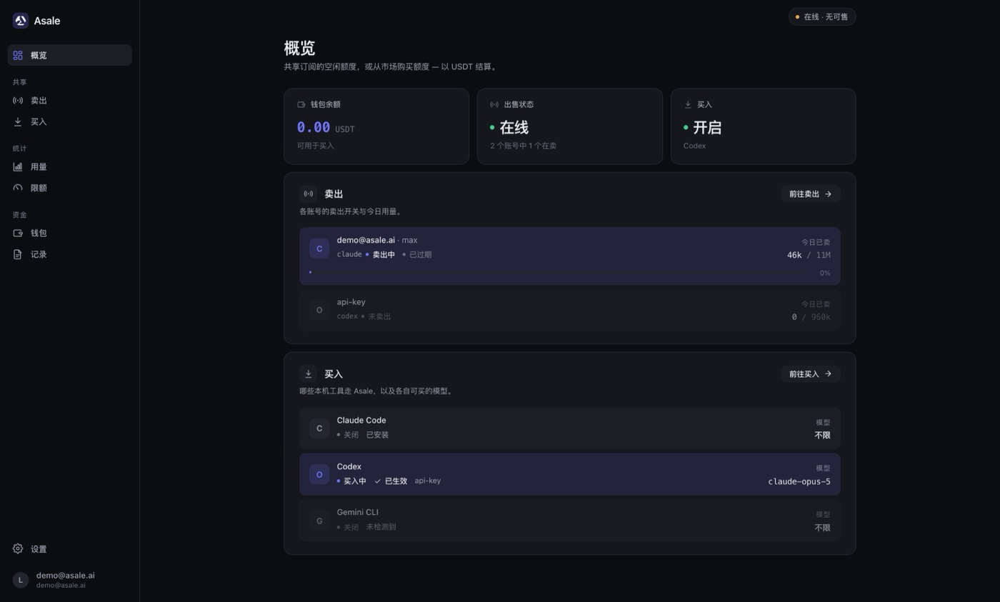
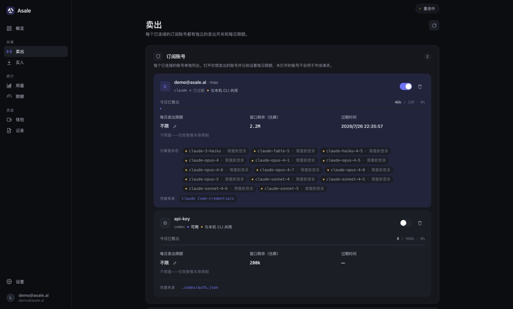
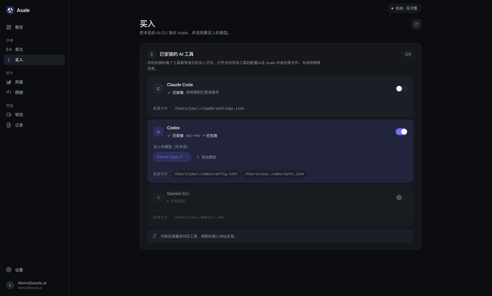
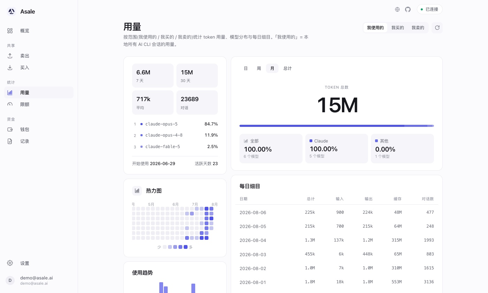

# Asale 客户端

### 把没用完的 Token，分享给需要的人

闲置额度换成收益，撞上限额时有人接力。

[English](README.md) · **简体中文** · [繁體中文](README.zh-TW.md) · [日本語](README.ja.md)

[官网](https://asale.ai) · [模型市场](https://asale.ai/zh/market) ·
[全球分布](https://asale.ai/zh/distribution) · [钱包](https://asale.ai/zh/wallet) ·
[**⬇ 下载客户端**](#下载与安装)

---

## 这是什么

你买了 Claude Pro / Max、ChatGPT Plus / Codex 这类**按订阅计费**的套餐。
额度按窗口刷新，用不完就作废；而在地球另一边，有人正卡在限额上等窗口重置。

**Asale 是一个 Token 共享网络**，把这两件事接起来：

- **卖出** —— 你的闲置订阅额度进入市场，别人撞限额时接过去用，你收 USDT。
- **买入** —— 你的 AI CLI 指向 Asale，以低于官方 API 的价格用别人的闲置额度顶上。

平台只做**撮合、转发与计费**，一分钟结一次账，钱走 USDT（TRC20）。

这里是它的**桌面客户端** —— 卖出方和买入方都在这个应用里，一个装机两件事。

### Token 来源平台

Claude Pro / Max · ChatGPT / Codex · Google Gemini · Kimi · xAI Grok

其中客户端已实现登录与配置切换的是 **Claude Code**、**Codex**、**Gemini CLI**，
其余在协议里已有位置，随适配器补齐。

---

## 功能

### 卖出 · 把闲置订阅共享出去

每个已连接的订阅账号**单独一个开关**，只有你打开的账号才会接市场请求。每日卖出限额
按账号设置，到额自动停；窗口剩余、过期时间、当日已售一目了然。

凭证来自本机已登录的 CLI（`Claude Code credentials`、`.codex/auth.json` …），也可以在
客户端里走 OAuth 重新登录。**凭证只留在本机**，进 OS keychain，数据库里只存引用。

### 买入 · 让本机的 AI CLI 走 Asale

自动检测本机装了哪些工具（Claude Code / Codex / Gemini CLI），每个工具一个开关。打开
时改写该工具的配置指向 Asale，并**备份原文件**；关闭时原样还原 —— 随时可以退回官方。
买入的模型按工具单独选，可多选。

### 用量与限额 · 别把自己的日常用量卖光

按「我使用的 / 我买的 / 我卖的」三个口径统计 token 用量、模型分布与每日细目，配热力图
与趋势图。限额页把卖出上限设成**订阅额度的百分比**，给自己留足日常余量。

### 钱包与记录

钱包页对账 USDT 收支：可用余额、冻结（预授权）、待结算收益，充值提现走 TRON。记录页
列出每一笔中转，**发布方与订阅方的记录可以互相核对**，平台抽成比例是否生效一目了然。
同一套数据在 [网页控制台](https://asale.ai/zh/records) 也能看。

---

## 下载与安装

免费。最省事的方式是打开[**官网首页**](https://asale.ai)，它会自动识别你的系统并给出对应安装包。
也可以直接点下面的直达链接：

| 平台 | 直达链接 |
|---|---|
| macOS（Apple 芯片 / Intel 通用） | [asale.ai/dl/mac](https://asale.ai/dl/mac) |
| Windows | [asale.ai/dl/windows](https://asale.ai/dl/windows) |
| Linux AppImage | [asale.ai/dl/linux-appimage](https://asale.ai/dl/linux-appimage) |
| Linux .deb | [asale.ai/dl/linux-deb](https://asale.ai/dl/linux-deb) |

上面刻意没有版本号：每个链接都在你点击的那一刻去解析最新的
[GitHub release](https://github.com/asale-ai/asale/releases)，所以这里永远不会过期。
该版本没构建的平台会跳回下载区 —— Windows / Linux 版需要在对应系统上构建
（Tauri 不能跨系统打包），见[开发文档 · 打包](docs/DEVELOPMENT.zh-CN.md#打包)。

### macOS 安装

1. 下载 `.dmg`，打开后把 **Asale** 拖进「应用程序」。
2. 没有第二步。发布包都用 Developer ID 证书签名并通过了 Apple 公证，macOS 不会拦。

装好之后应用会在后台常驻（菜单栏图标），支持开机自启，新版本自动更新。

### 首次使用

1. 打开客户端，用 Asale 账号**登录**（没有就在
   [asale.ai](https://asale.ai) 注册，支持 OAuth）。
2. **想卖**：去「卖出」页 →「连接订阅」，选平台完成 OAuth 登录；客户端也会自动识别本机
   已登录的 CLI 凭证。打开账号开关、设好每日限额，状态变成「在线」就开始接单。
3. **想买**：先在「钱包」充值 USDT，再去「买入」页打开对应工具的开关、选好模型，
   **重启该 CLI** 让新接入地址生效。

> ⚠️ 别在一个正在运行的 Claude Code 会话里切换 Claude Code 的买入开关 —— 配置被改写会
> 让当前会话失联。切换后重启工具即可。

---

## 安全与隐私

与[官网「安全与隐私」](https://asale.ai/zh)一致，这里是对应到代码的版本：

- **不保存、不缓存对话内容。** 平台只做撮合、转发与计费：数据库没有正文字段，
  内存逐块转发，不进 Redis，日志不打印正文。
- **全链路加密与签名。** 每一跳都在 TLS 1.2/1.3 信道内；设备用 Ed25519 身份签握手，
  每次派单都验签；客户端**拒绝任何明文远程地址**（非 loopback 必须 https/wss）。
- **不擅自采集。** 上报字段只有随机 UUID 设备 ID、版本、系统名与心跳；
  不采硬件指纹、不做 IP 定位，用量统计不出本机。
- **凭证不出本机。** 订阅凭证存在 OS keychain 与 `~/.asale/auths`，服务端只拿到引用。

> **透明声明：** 请求最终由另一位用户的客户端代发给上游，正文那一刻对该客户端可见。
> 我们不做、也无法做端到端加密，**请勿传输机密信息**。

客户端源码就在本仓库，上面每一条都可以自己核对。

---

## 开发者

架构说明、本地开发、打包与发布流程见 **[docs/DEVELOPMENT.zh-CN.md](docs/DEVELOPMENT.zh-CN.md)**。

---

## 许可与风险

[Apache License 2.0](LICENSE)

Asale 仅提供技术中转。**共享订阅算力可能违反上游服务条款，风险自负。**
