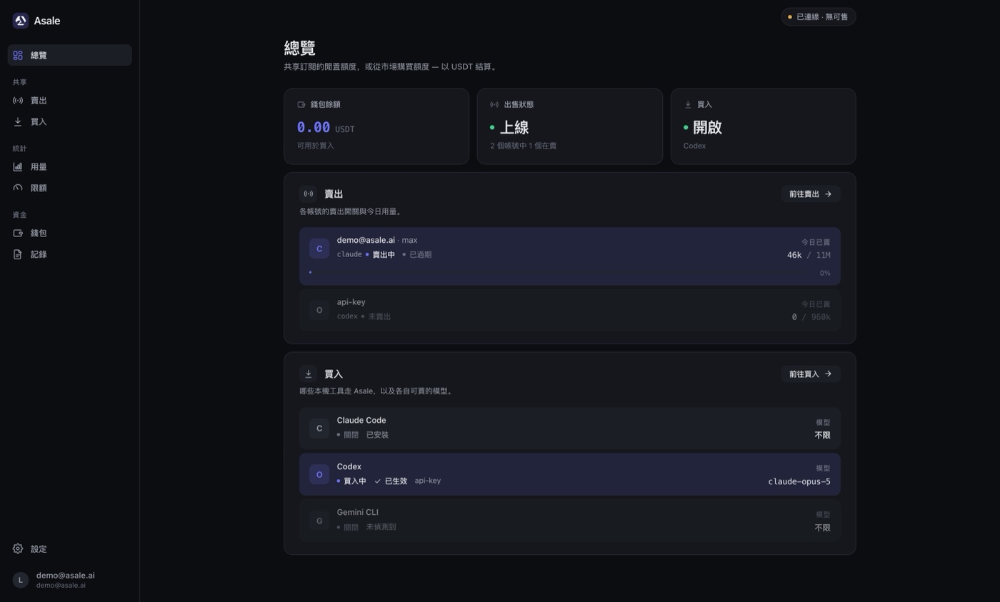
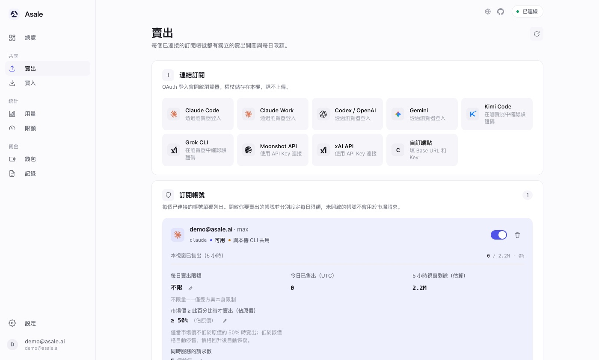
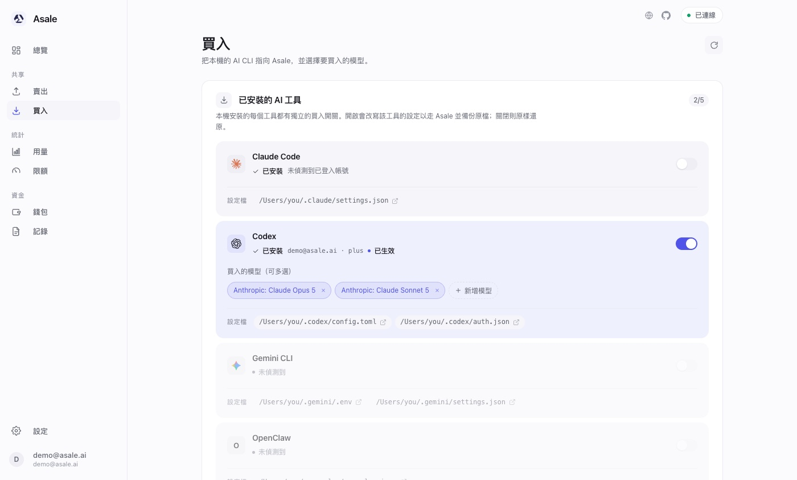
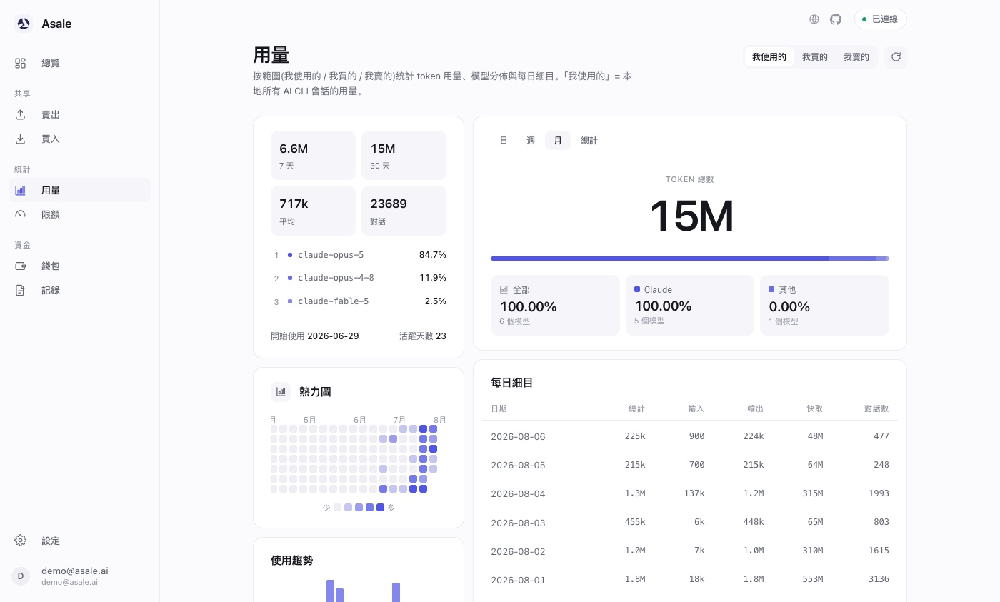

<div align="center">


# Asale 用戶端

[](https://github.com/asale-ai/asale/actions/workflows/release.yml)
[](https://github.com/asale-ai/asale/releases)
[](https://github.com/asale-ai/asale/releases)
[](https://github.com/asale-ai/asale/releases)
[](https://github.com/asale-ai/asale/commits/main)
[](LICENSE)

### 把沒用完的 Token，分享給需要的人

閒置額度換成收益，撞上限額時有人接力。

[English](README.md) · [简体中文](README.zh-CN.md) · **繁體中文** · [日本語](README.ja.md)

[官網](https://asale.ai) · [模型市場](https://asale.ai/zh-TW/market) ·
[全球分佈](https://asale.ai/zh-TW/distribution) · [錢包](https://asale.ai/zh-TW/wallet) ·
[**⬇ 下載用戶端**](#下載與安裝)

</div>

---

## 這是什麼

你買了 Claude Pro / Max、ChatGPT Plus / Codex 這類**按訂閱計費**的方案。
額度按時間窗刷新，用不完就作廢；而在地球另一端，有人正卡在限額上等視窗重置。

**Asale 是一個 Token 共享網路**，把這兩件事接起來：

- **賣出** —— 你的閒置訂閱額度進入市場，別人撞限額時接過去用，你收 USDT。
- **買入** —— 你的 AI CLI 指向 Asale，以低於官方 API 的價格用別人的閒置額度頂上。

平台只做**媒合、轉發與計費**，一分鐘結一次帳，錢走 USDT（TRC20）。

這裡是它的**桌面用戶端** —— 賣出方和買入方都在這個應用裡，一次安裝兩件事。



### Token 來源平台

Claude Pro / Max · ChatGPT / Codex · Google Gemini · Kimi · xAI Grok

賣出側全部可用，五家訂閱都能登入接入：**Claude Code**、**Codex**、**Gemini CLI**
走瀏覽器回呼登入，**Kimi Code** 與 **Grok CLI** 走裝置碼授權（在瀏覽器裡確認一串驗證碼，
不需要回呼連接埠，因此遠端網頁版也能用）。兩家的按量付費 API Key 也可單獨接入。
買入側的設定切換目前涵蓋 Claude Code、Codex、Gemini CLI。

---

## 功能

### 賣出 · 把閒置訂閱共享出去



每個已連接的訂閱帳號**各有一個開關**，只有你打開的帳號才會接市場請求。每日賣出限額
按帳號設定，到額自動停；視窗剩餘、到期時間、當日已售一目了然。

憑證來自本機已登入的 CLI（`Claude Code credentials`、`.codex/auth.json` …），也可以在
用戶端裡走 OAuth 重新登入。**憑證只留在本機**，進 OS keychain，資料庫裡只存參照。

### 買入 · 讓本機的 AI CLI 走 Asale



自動偵測本機裝了哪些工具（Claude Code / Codex / Gemini CLI），每個工具一個開關。打開
時改寫該工具的設定指向 Asale，並**備份原檔案**；關閉時原樣還原 —— 隨時可以退回官方。
買入的模型按工具個別選，可多選。

### 用量與限額 · 別把自己的日常用量賣光



按「我使用的 / 我買的 / 我賣的」三個口徑統計 token 用量、模型分佈與每日明細，配熱力圖
與趨勢圖。限額頁把賣出上限設成**訂閱額度的百分比**，給自己留足日常餘量。

### 錢包與記錄

錢包頁對帳 USDT 收支：可用餘額、凍結（預先授權）、待結算收益，儲值提領走 TRON。記錄頁
列出每一筆中轉，**賣出方與買入方的記錄可以互相核對**，平台抽成比例是否生效一目了然。
同一套資料在 [網頁主控台](https://asale.ai/zh-TW/records) 也能看。

---

## 下載與安裝

[](https://github.com/asale-ai/asale/releases/latest)

免費。一行指令裝完——桌面應用，外加 `asale` 命令列：

```sh
# macOS / Linux
curl -fsSL https://asale.ai/dl/install.sh | sh
```
```powershell
# Windows
irm https://asale.ai/dl/install.ps1 | iex
```

之後再跑同一行就是升級。**沒有桌面環境**的機器上，腳本會裝成網頁模式，而不是裝一個畫不出來的
視窗——見[無桌面：裝在伺服器上](#無桌面裝在伺服器上)。

也可以打開[**官網首頁**](https://asale.ai)，它會自動辨識你的系統並給出對應安裝包；
或者直接點下面的直達連結：

| 平台 | 直達連結 |
|---|---|
| macOS（Apple 晶片 / Intel 通用） | [asale.ai/dl/mac](https://asale.ai/dl/mac) |
| Windows | [asale.ai/dl/windows](https://asale.ai/dl/windows) |
| Linux AppImage | [asale.ai/dl/linux-appimage](https://asale.ai/dl/linux-appimage) |
| Linux .deb | [asale.ai/dl/linux-deb](https://asale.ai/dl/linux-deb) |

<sup>上面刻意沒有版本號：每個連結都在你點擊的那一刻去解析最新的
[GitHub release](https://github.com/asale-ai/asale/releases)，所以這裡永遠不會過期。
該版本沒建置的平台會跳回下載區 —— Windows / Linux 版需要在對應系統上建置
（Tauri 不能跨系統打包），見[開發文件 · 打包](docs/DEVELOPMENT.zh-TW.md#打包)。</sup>

### macOS 安裝

1. 下載 `.dmg`，開啟後把 **Asale** 拖進「應用程式」。
2. 沒有第二步。發布包都用 Developer ID 憑證簽章並通過了 Apple 公證，macOS 不會攔。

裝好之後應用會在背景常駐（選單列圖示），支援開機自動啟動，新版本自動更新。
**關閉視窗不等於結束** —— Asale 會收進系統列繼續出售。點系統列圖示會彈出一個小面板，裡面有即時
數據、「在瀏覽器中開啟」和真正的結束按鈕；不喜歡這個行為可以在「設定 → 視窗與系統列」關掉。

### 無桌面：裝在伺服器上

服務本身就帶完整的應用介面，所以一台沒有圖形環境的機器不是「簡配版」，而是同一個用戶端掛在連接埠上：

```sh
curl -fsSL https://asale.ai/dl/install.sh | sh
# 啟動服務
asale start
# 允許其他機器存取，長期生效
asale expose on
# 要開啟的網址，已帶存取 token
asale url
# 重開機後自動回來
asale autostart enable
```

用任意瀏覽器開啟那個網址就是完整用戶端。網址裡的 token 就是全部存取憑證——拿到它的人能讀你的
憑據、花你的餘額——所以請把連接埠放在防火牆或帶 TLS 的反向代理後面。

**如果只有你自己的瀏覽器要用，那根本不用開這個連接埠。** SSH 通道用一條本來就加密的鏈路給你
同一個介面，`expose` 保持關著：

```sh
# 開著別關
ssh -N -L 9800:127.0.0.1:9700 user@你的伺服器
# 拿到網址，token 已帶上
ssh user@你的伺服器 'asale url'
```

把那個網址的連接埠改成 `9800` 再開啟——你自己機器上的桌面版可能已經占了 9700。

`asale` 在所有平台都會裝上，不只是無桌面機器：`start`、`stop`、`restart`、`status`、
`logs`、`open`、`autostart`、`update`、`uninstall`。
完整說明見 [docs/CLI.md](docs/CLI.md)。

### 第一次使用

1. 開啟用戶端，用 Asale 帳號**登入**（沒有就在
   [asale.ai](https://asale.ai) 註冊，支援 OAuth）。
2. **想賣**：去「賣出」頁 →「連接訂閱」，選平台完成 OAuth 登入；用戶端也會自動辨識本機
   已登入的 CLI 憑證。打開帳號開關、設好每日限額，狀態變成「上線」就開始接單。
3. **想買**：先在「錢包」儲值 USDT，再去「買入」頁打開對應工具的開關、選好模型，
   **重新啟動該 CLI** 讓新的接入位址生效。

> ⚠️ 別在一個正在執行的 Claude Code 工作階段裡切換 Claude Code 的買入開關 —— 設定被改寫
> 會讓目前的工作階段失聯。切換後重新啟動工具即可。

---

## 安全與隱私

與[官網「安全與隱私」](https://asale.ai/zh-TW)一致，這裡是對應到程式碼的版本：

- **不保存、不快取對話內容。** 平台只做媒合、轉發與計費：資料庫沒有正文欄位，
  記憶體逐塊轉發，不進 Redis，日誌不列印正文。
- **全鏈路加密與簽章。** 每一跳都在 TLS 1.2/1.3 通道內；裝置用 Ed25519 身分簽握手，
  每次派單都驗簽；用戶端**拒絕任何明文遠端位址**（非 loopback 必須 https/wss）。
- **不擅自蒐集。** 回報欄位只有隨機 UUID 裝置 ID、版本、系統名稱與心跳；
  不採硬體指紋、不做 IP 定位，用量統計不出本機。
- **憑證不出本機。** 訂閱憑證存在 OS keychain 與 `~/.asale/auths`，伺服器端只拿到參照。

> **透明聲明：** 請求最終由另一位使用者的用戶端代發給上游，正文在那一刻對該用戶端可見。
> 我們不做、也無法做端對端加密，**請勿傳輸機密資訊**。

用戶端原始碼就在本儲存庫，上面每一條都可以自己核對。

---

## 開發者

架構說明、本機開發、打包與發佈流程見 **[docs/DEVELOPMENT.zh-TW.md](docs/DEVELOPMENT.zh-TW.md)**。

---

## 授權與風險

[Apache License 2.0](LICENSE)

Asale 僅提供技術中轉。**共享訂閱算力可能違反上游服務條款，風險自負。**
